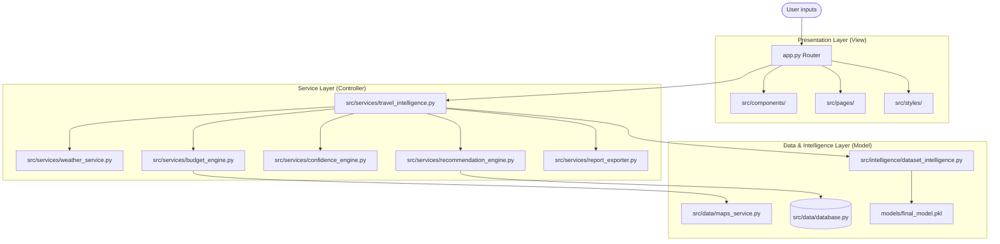

# TripAI — AI-Powered Travel Intelligence & Budget Planning Platform

[](https://traveltripbudgetprediction.streamlit.app/)

TripAI is a modern, production-grade Travel Intelligence Platform designed to predict, verify, and plan travel budgets across India. It integrates machine learning (Random Forest), live API services, SQLite tracking, and structured dataset analysis to deliver a premium MakeMyTrip/Airbnb-style travel planner.

---

## 🔗 Live Demo & Repository

* **Live Demo**: [https://traveltripbudgetprediction.streamlit.app/](https://traveltripbudgetprediction.streamlit.app/)
* **GitHub Repository**: [https://github.com/Srujanaaddanki/TravelTripBudgetPrediction](https://github.com/Srujanaaddanki/TravelTripBudgetPrediction)

---

## 📖 Project Overview

Planning travel across India often involves dealing with fragmented data:
* Budget estimates from machine learning models are usually decoupled from live transit routes and fuel/ticket price changes.
* Traditional systems rely on generic recommendations rather than historical dataset feedback from real travelers.
* Network failures or API quota limits can cause travel planning apps to crash when querying remote locations.

**TripAI** solves this by establishing a decoupled Model-View-Controller (MVC) architecture. It aligns base machine learning budget predictions (trained on historical traveler feedback) with dynamic geographic distance calculations, live transit multipliers, current weather forecasts, and a 3-tier local SQLite cache.

---

## ⚡ Features

* **AI Budget Predictions**: Employs a Random Forest Regressor trained on real Indian traveler records to estimate budgets based on destination, season, hotel quality tier, stay duration, and trip type.
* **3-Tier Caching System**: Optimizes external API latency and usage costs by resolving coordinates and routing maps through local SQLite caching first, falling back to a pre-seeded offline city catalog, and lastly querying live APIs only on cache misses.
* **Live Weather Integration**: Connects to the keyless Open-Meteo API to recursively pull real-time weather forecasts (temperature, wind, precipitation) for any destination coordinates.
* **Geospatial Mapping**: Renders interactive satellite/road travel route maps dynamically using Folium and Streamlit-Folium, with custom icons and alternative waypoint routes.
* **SaaS Analytics Dashboard**: Captures local search history in an SQLite database (using Write-Ahead Logging for concurrency) to display trending destinations, average travel budgets, and transit mode shares.
* **Exportable Reports**: Dynamically compiles predicted budgets, packing checklists, destination safety alerts, and seasonal tips into a downloadable PDF report.

---

## 🏗️ Architecture

TripAI enforces a clean Model-View-Controller design to decouple components and ensure interview-readiness:

### Workflow Diagram



### Decoupled Folder Structure

```
TravelTripBudgetPrediction/
├── app.py                      # Application Entry Point
├── train_model.py              # ML Model Training Pipeline
├── requirements.txt            # Package Dependencies
├── runtime.txt                 # Deployment Runtime Version
├── LICENSE                     # Project License
├── .gitignore                  # Git Ignore Rules
├── config/                     # Global Config
│   ├── settings.py             # System Path Settings
│   └── constants.py            # Platform Constants
├── data/                       # Dataset Storage
│   └── traveltripdata.csv      # Raw Traveler Survey Dataset
├── models/                     # Pickled Models & Encoders
│   ├── final_model.pkl         
│   ├── encoders.pkl            
│   └── model_accuracy.pkl      
├── docs/                       # Documentation Guides
│   ├── GOOGLE_MAPS_SETUP.md    # API Configuration Instructions
│   └── RESUME_POINTS.md        # Recruiter Placement Bullets
├── tests/                      # Verification Tests
│   ├── test_geo.py             
│   ├── test_route.py           
│   ├── test_checklists_and_routes.py
│   └── test_search_tracking.py 
├── src/                        # Core Source Code
│   ├── components/             # Reusable UI Widgets (Navbar, Footer, Hero, Maps)
│   ├── pages/                  # Streamlit Page Views (Plan Trip, Analytics)
│   ├── services/               # Engine Controllers (Weather, Budget, Gemini)
│   ├── intelligence/           # Dataset Intelligence & Knowledge Bases
│   └── styles/                 # Tailwind/SaaS Custom CSS Variables
```

---

## 🛠️ Technologies

* **Frontend & Presentation**: Streamlit, HTML5, Custom CSS
* **Geospatial & Visualization**: Folium, Streamlit-Folium, Plotly Express
* **Machine Learning & Preprocessing**: Scikit-Learn (Random Forest Regressor), Joblib, Pandas, NumPy
* **Database & Caching**: SQLite3 (WAL mode), SQLite Memory databases
* **APIs & Networks**: Open-Meteo API, Google Maps Distance Matrix API

---

## ⚡ Installation

### 1. Clone the repository
```bash
git clone https://github.com/Srujanaaddanki/TravelTripBudgetPrediction.git
cd TravelTripBudgetPrediction
```

### 2. Install dependencies
Ensure you are using Python 3.9+ and run:
```bash
pip install -r requirements.txt
```

### 3. Verify the installation
Run the integration test suite to verify the database and caching system:
```bash
python tests/test_search_tracking.py
```

### 4. Launch the application locally
```bash
streamlit run app.py
```

---

## 🖼️ Screenshots

*(Screenshots of planning forms, interactive map routes, confidence metrics, and SaaS analytics dashboard here during portfolio hosting)*

---

## 💼 Highlights

* **Machine Learning Performance**: Engineered a Random Forest Regressor (200 decision trees) achieving a **~95% $R^2$ accuracy score** in predicting travel budgets across India.
* **Advanced Caching Architecture**: Created a **3-tier cache structure** in SQLite (WAL mode) for coordinate lookup and route matrices, protecting API quotas and reducing external latency.
* **Robust Fallback Engine**: Designed a graceful fallback system mapping traveler feedback datasets and pre-seeded rules to ensure continuous operation during API offline states.
* **Modular Clean Code**: Built a decoupled MVC codebase, maintaining individual file sizes under 300 lines with type hints and automated unit tests.
