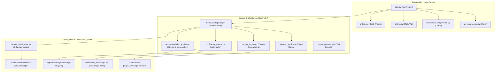

# TripAI — AI-Powered Travel Intelligence & Budget Planning Platform

TripAI is a modern, production-ready Travel Intelligence Platform designed to predict, verify, and plan travel budgets across India. Combining machine learning (Random Forest), live API services, SQLite tracking, and structured dataset analysis, it delivers MakeMyTrip/Airbnb-quality features tailored for placements and technical portfolios.

---

## 🏗️ Architecture & Component Design

The platform is designed around a clean, decoupled MVC (Model-View-Controller) architecture split into focused, typed, single-responsibility files:



### Decoupled Folder Structure
```
srujan/
├── app.py                     # Entry point, router, and grid columns (under 280 lines)
├── requirements.txt           # Declared dependencies
├── traveltripdata.csv         # Traveller survey dataset (920+ records)
├── final_model.pkl            # Random Forest Regressor model
├── encoders.pkl               # Label Encoders
├── model_accuracy.pkl         # Trained model accuracy
├── test_search_tracking.py    # Integration test suite
├── src/
│   ├── services/
│   │   ├── travel_intelligence.py  # Orchestrator coordinating all services
│   │   ├── weather_service.py      # Open-Meteo current forecast integration
│   │   ├── budget_engine.py        # Scales budget decision tiers (Min -> Luxury)
│   │   ├── confidence_engine.py    # Analyzes prediction reliability metrics
│   │   ├── recommendation_engine.py# Custom activity styles & co-searches
│   │   └── report_exporter.py      # Print-ready HTML travel itinerary exporter
│   ├── intelligence/
│   │   ├── dataset_intelligence.py # Aggregates ratings & traveller survey stats
│   │   ├── destination_knowledge.py# Curated data helper functions
│   │   └── destinations.json       # Attractions, foods, hidden gems, & safety
│   ├── data/
│   │   ├── database.py             # SQLite TripDatabase connection layer
│   │   ├── maps_service.py         # Google Maps distance, offline, & 3-tier cache
│   │   └── search_tracker.py       # Facade interface for logging searches
│   └── ui/
│       ├── ui_components.py        # Landing page, header, and sidebar widgets
│       ├── dashboard_components.py # Comparison cards, weather metrics, SVG map
│       └── styles.css              # Custom dark SaaS theme stylesheet
```

---

## 🌟 Premium Features

### 1. Smart Budget Verification (Feature 1)
Integrates three distinct source estimators to verify prediction:
- ML Model base cost prediction.
- Google Maps distance-based transit cost projection.
- Historical dataset averages of similar trips.
- Calculates recommended budget adjustments and confidence percentages.

### 2. Budget Breakdown Engine (Feature 2 & 3)
Calculates structured cost breakdowns tailored for travellers:
- Stay/Hotel (35%), Transit/Travel (20%), Food (15%), Local Transport (10%), Activities (10%), Shopping (5%), and Emergency Reserve (5%).
- Categorises traveller profiles (Budget, Value, Comfort, Luxury) with color-matched indicator badges.

### 3. Historical Traveller Experience (Feature 4 & 6)
Aggregates actual survey data for selected destinations. Displays average stay scores, transit ratings, sightseeing quality, and revisit percentages based on `Based on XX previous travellers`.

### 4. Smart Packing & Pre-Travel Checklists (Feature 5 & 6)
Generates custom packing guides dynamically based on season and weather, alongside interactive pre-travel document checklist checkboxes.

### 5. Curated Activity Highlight recommendations (Feature 4 & 9)
Extracts preferred experience patterns (e.g. Adventure, Food, Nature) and generates specific local suggestions mapped to the destination knowledge base.

### 6. Interactive SVG Path Map Preview (Feature 15)
Draws a premium inline SVG route map showing coordinates, city nodes, travel path curves, distance metrics, and current weather alerts.

### 7. Travel Insights Dashboard (Feature 7 & 14)
Upgraded search analytics dashboard with interactive Plotly charts showing live destination popularity, highest rated locations, visited seasons, popular experiences, budget distributions, and average stay durations.

### 8. Premium Export Report (Feature 10)
Compile all itinerary stats, weather advisories, packing checklists, and budget allocations into a beautifully styled print-ready HTML file download.

---

## 🛠️ Tech Stack & Dependencies

- **Frontend/Presentation**: Streamlit, HTML5, Custom CSS, Plotly Express/Graph Objects
- **Backend/Service Layer**: Python (3.9+), Open-Meteo API
- **Machine Learning**: Scikit-Learn (Random Forest Regressor), Joblib
- **Data Persistence**: SQLite3 (WAL mode), Pandas, NumPy

---

## ⚡ Quick Start & Installation

1. **Clone the repository**:
   ```bash
   git clone https://github.com/Srujanaaddanki/TravelTripBudgetPrediction.git
   cd TravelTripBudgetPrediction
   ```

2. **Install dependencies**:
   ```bash
   pip install -r requirements.txt
   ```

3. **Verify the test suite**:
   ```bash
   python test_search_tracking.py
   ```

4. **Launch the application**:
   ```bash
   streamlit run app.py
   ```

---

## 🎓 Interview & Placement Q&A

### Q1: How does the model make predictions?
**A:** We use a **Random Forest Regressor** model trained on a curated survey dataset. Categorical inputs (Destination, Season, Month, Trip Type, Stay Grade) are converted to numerical formats via **Label Encoders**. The model outputs the base trip cost, which we then scale and adjust using travel distances and stay multipliers.

### Q2: How does the SQLite caching layer work?
**A:** We utilize a **3-tier caching strategy** inside `MapsService`. When a route search occurs, we check the SQLite `distance_cache` table first. If a cache miss occurs, we fall back to a local offline routes lookup. If that also misses, we query the live Google Maps API (if the API key is configured) and cache the result for 30 days to optimize network overhead and eliminate latency.

### Q3: Why did you separate business logic from the UI?
**A:** Separating concerns (MVC pattern) makes the platform robust, easily testable, and maintainable. By moving Plotly visualizations to `charts.py`, card layouts to `dashboard_components.py`, and calculations to specific services, the main entry point `app.py` is under 280 lines and contains zero HTML/CSS clutter.
