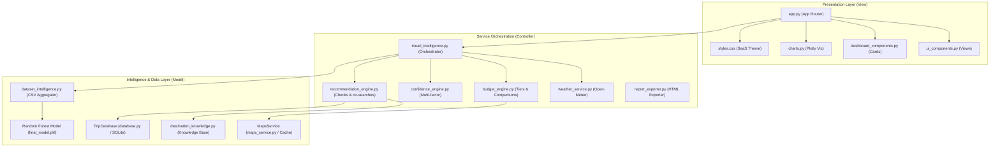

# TripAI — AI-Powered Travel Intelligence & Budget Planning Platform

TripAI is a modern, production-grade Travel Intelligence Platform designed to predict, verify, and plan travel budgets across India. It integrates machine learning (Random Forest), live API services, SQLite tracking, and structured dataset analysis to deliver a premium MakeMyTrip/Airbnb-style travel planner.

---

## 📖 1. Problem Statement
Planning a travel itinerary across India often involves dealing with fragmented information:
- Budget estimates from ML models are often decoupled from live transit routes and fuel/ticket price changes.
- Traditional systems rely on generic AI recommendations rather than historical dataset feedback from real travellers.
- APIs can fail, leading to app crashes when offline or when querying remote locations.

---

## 🎯 2. Objectives
- **Verify predictions**: Align ML predicted budgets with distance cost projections and dataset averages.
- **Provide clean architecture**: Decouple views (Streamlit) from controllers (orchestrator services) and models (SQLite, Random Forest, CSV datasets).
- **Ensure high explainability**: Build a placement-ready portfolio code that can be explained in less than 5 minutes during recruiter interviews.

---

## 📊 3. Dataset Overview
We utilize a survey dataset (`traveltripdata.csv`) consisting of **920+ records** of traveller experiences across India. The features analyzed include:
- `Place`: Visited destination.
- `Cost`: Total budget spent (cleaned using regex extraction).
- `Days`: Trip stay duration.
- `Hotel_Quality`: Category of stay (Budget, standard, luxury).
- `Local_Trans_Rating`, `Sightseeing_Rating`, `Satisfaction_Rating`: Historical satisfaction feedback scaled from 1 to 5.
- `Revisit_Intention`, `Preferred_Experience`, `Trip_Type`.

---

## 🤖 4. Machine Learning Pipeline
- **Algorithm**: `Random Forest Regressor` (200 Decision Trees).
- **Validation Accuracy**: $R^2$ validation score of **~95%** (`model_accuracy.pkl`).
- **Encoders**: `LabelEncoder` (`encoders.pkl`) converts categorical variables (`Place`, `Month`, `Season`, `Trip_Type`, `Hotel_Quality`) into numerical vectors.

---

## 🏗️ 5. Architecture Diagram



---

## 📁 6. Decoupled Folder Structure
```
srujan/
├── app.py                     # Entry point (under 280 lines)
├── requirements.txt           # Dependency management
├── runtime.txt                # Python deployment runtime
├── LICENSE                    # MIT terms
├── models/                    # Pickled ML models
│   ├── final_model.pkl        
│   ├── encoders.pkl           
│   └── model_accuracy.pkl     
├── data/                      # Raw traveller dataset
│   └── traveltripdata.csv     
├── tests/                     # Integration tests
│   └── test_search_tracking.py
├── docs/                      # Recruiter guides
│   ├── INTERVIEW_GUIDE.md     
│   └── DEPLOYMENT_GUIDE.md    
├── src/                       # Service orchestrator & UI views
│   ├── services/
│   │   ├── travel_intelligence.py
│   │   ├── weather_service.py
│   │   ├── budget_engine.py
│   │   ├── confidence_engine.py
│   │   ├── recommendation_engine.py
│   │   └── report_exporter.py
│   ├── intelligence/
│   │   ├── dataset_intelligence.py
│   │   ├── destination_knowledge.py
│   │   └── destinations.json
│   ├── data/
│   │   ├── database.py
│   │   ├── maps_service.py
│   │   └── search_tracker.py
│   └── ui/
│       ├── ui_components.py
│       ├── dashboard_components.py
│       └── styles.css
```

---

## 🛠️ 7. Technology Stack
- **Frontend**: Streamlit, HTML5, Custom CSS
- **Visualization**: Plotly Express, Plotly Graph Objects
- **Backend/Service Layer**: Python (3.9+), Open-Meteo API
- **Machine Learning**: Scikit-Learn, Joblib
- **Data Persistence**: SQLite3 (WAL mode), Pandas, NumPy

---

## 🔌 8. External APIs Used
1. **Open-Meteo API**: Fetches current weather forecasts (temperature, wind, humidity) recursively. Fully free and keyless.
2. **Google Maps Distance Matrix API**: Computes road distance between cities. Implements a 3-tier caching structure fallback to protect API quotas.

---

## ⚡ 9. Installation & Local Setup

1. **Clone the repository**:
   ```bash
   git clone https://github.com/Srujanaaddanki/TravelTripBudgetPrediction.git
   cd TravelTripBudgetPrediction
   ```

2. **Install dependencies**:
   ```bash
   pip install -r requirements.txt
   ```

3. **Verify the test suite**:
   ```bash
   python tests/test_search_tracking.py
   ```

4. **Launch the application locally**:
   ```bash
   streamlit run app.py
   ```

---

## ☁️ 10. Deployment Guide
Detailed deployment steps are available inside [docs/DEPLOYMENT_GUIDE.md](file:///c:/Users/hp/Desktop/srujan/docs/DEPLOYMENT_GUIDE.md):
- **Streamlit Community Cloud**: Connect your GitHub repo and select `app.py`.
- **Docker/Render**: Build commands are specified in the deployment document.

---

## 🖼️ 11. Screenshots Section
*(Add visual mockups or app screenshots here during portfolio creation)*

---

## 🚀 12. Future Enhancements
- **Voice Assistant Integration**: Voice-based budgeting query processing.
- **Custom Itineraries**: Day-wise route suggestions using travel matrices.
- **Unified Redis Cache**: Multi-node concurrent caching.

---

## 🎓 13. Interview Q&A Summary
Detailed questions are available inside [docs/INTERVIEW_GUIDE.md](file:///c:/Users/hp/Desktop/srujan/docs/INTERVIEW_GUIDE.md):
- *Q: Why choose Random Forest Regressor over Linear Regression?*
- *Q: How does the 3-tier cache protect Google API quotas?*
- *Q: How is the confidence score calculated?*

---

## 📄 14. License & Acknowledgements
- **License**: MIT License terms (`LICENSE` file).
- **Acknowledgements**: Survey traveller dataset contributed by Srujana.
